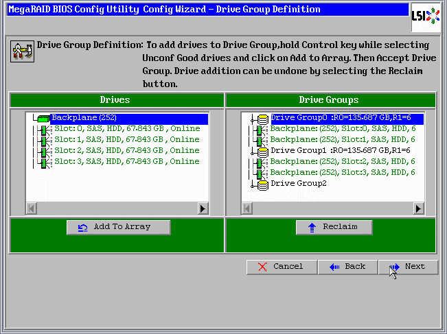

# 1.创建RAID 10

创建LSI RAID10

在启动界面显示硬盘的时候按crtl+h进入webbios界面如下

选择[ Configuration Wizard ]

选择 [ New Configuration ]

选择 [ Manual Configuration ]

您可以在上面的图片的Drive Group0

按ctrl选择两块硬盘，如果是键盘操作可以选择一块做两次选择[ Add to Array ]

如上图显示两个盘应该移动已在右框的[Drive Group0]。

选择[ Accept DG ]添加一个Drive Group

如上图现在您应该看到出现了一个Drive Group1

按ctrl选择后面两块硬盘再次点[ Add to Array ]

 

你必须再次点击[ Accept DG ] 增加一个组隔断上面的组，这将多出一个新的组可以忽略不管它。
如果您的RAID10将基于6,8或10个硬盘，然后根据需要，直到所有的1级重复此过程镜像（硬盘组）的定义。

现在已经配置好了选择 [ Next ]

 

如上图，可以我们定义其镜像集（硬盘组），选择第一个阵列，然后单击[Add to SPAN]

如上图将一个组移动到右边，然后再移动第二个组如下图

完成后选择 [ Next ]

在上图中可以看懂RAID级别已经被检测为RAID10（早期固件级别自动识别可能不是很有用）在这个例子中RAID10的基本配置已经搞定。

在[Select Size]填写上R10的容量就可以完成了，组RAID10千万别选择错了。

选择[ Select Accept ]

另外还有高速缓存策略的详细信息，有空将详说。

